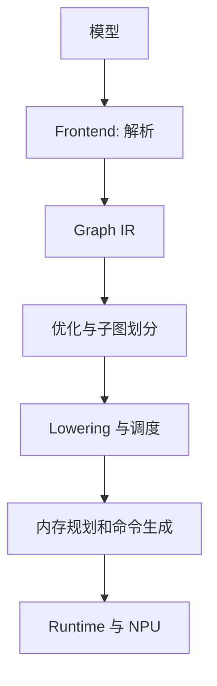

# 图编译器原理

图编译器将模型的数学语义转换为目标设备可执行的程序。与传统编译器相比，重点在张量形状、数据布局、跨算子优化、内存和并行计算。训练更新权重；推理使用固定权重计算输出；离线编译通常在部署之前完成。

```mermaid
flowchart TD
 A[模型] --> B[Frontend: 解析]
 B --> C[Graph IR]
 C --> D[优化与子图划分]
 D --> E[Lowering 与调度]
 E --> F[内存规划和命令生成]
 F --> G[Runtime 与 NPU]
```
AOT 提前编译，JIT 在运行时编译；静态 shape 可提前规划内存，动态 shape 需要约束、特化或运行时处理。
